<!-- PROJECT LOGO -->
<br />
<p align="center">
  <a href="https://github.com/othneildrew/Best-README-Template">
    
  </a>

  <h3 align="center"> Publicty - An app for my college </h3>

  <p align="center">
    A task automation app
    <br />
    <a href="https://github.com/ram2510/publicty-app"><strong> Explore the docs » </strong></a>
    <br />
    <br />
    ·
    <a href="https://github.com/ram2510/publicty-app/issues">Report Bug</a>
    ·
    <a href="https://github.com/ram2510/publicty-app/issues">Request Feature</a>
  </p>
</p>


<!-- TABLE OF CONTENTS -->
## Table of Contents

- [Table of Contents](#table-of-contents)
- [About The Project](#about-the-project)
  - [Built With](#built-with)
- [Getting Started](#getting-started)
  - [Prerequisites](#prerequisites)
- [Features](#features)
- [Contributing](#contributing)
- [License](#license)


<!-- ABOUT THE PROJECT -->
## About The Project

The main idea of this product is as follows - 
- College has to store and use the details of the various secratries of different colleges. 
- Before the college use to store the data in the excel sheets and use them, this would create a lot of chaos plus data was not centralised
- Using this app now the data is being centralised plus it's a lot convienent for the users to carry and edit
- This app consists of 2 users one admin right that can add colleg codes analyse activivty etc.


> Note the data in the app is hard code and you can find the products data in the data directory so I have coded in a way which can be easily replacable with an api call

### Built With

* [react-native](https://facebook.github.io/react-native/)


<!-- GETTING STARTED -->
## Getting Started

1. Clone the repo 
2. Install all the packages in the package.json file and follow the instructions mentioned on thier readme pages for correctly installing them
3. Run the command   To start the app in development server
  ```
  react-native run android
  ```


3. For building the production apk navigate to the root directory and run    To bundle the assets

  ```
  react-native bundle --platform android --dev false --entry-file index.js \
  --bundle-output android/app/src/main/assets/index.android.bundle \
  --assets-dest android/app/src/main/res/
  ```

4. Then navigate to the android directory and run the command
  ```
  ./gradlew assembleRelease -x bundleReleaseJsAndAssets 
  ```
5. Now you can find the release apk in `android/app/build/outputs/apk/release`

### Prerequisites
1. Install react-native


<!-- USAGE EXAMPLES -->
## Features
1. When you first open the app you will see the splash screen
  


2. If you have not previously logged in the app you will be directed to the login screen
   
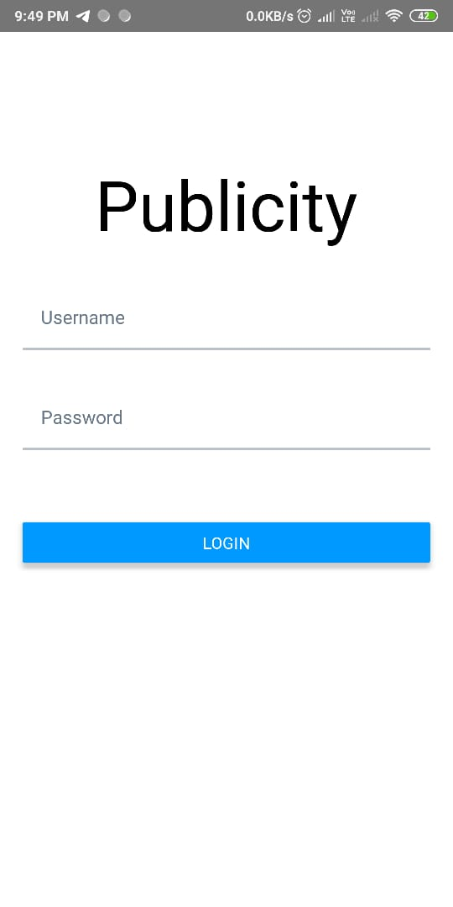


1. If you have been logged in you will be directed towards the main screen which consists of 
   - Details added. The user can view the data for a particular user in 3 steps from here 
     1) first select the college
   
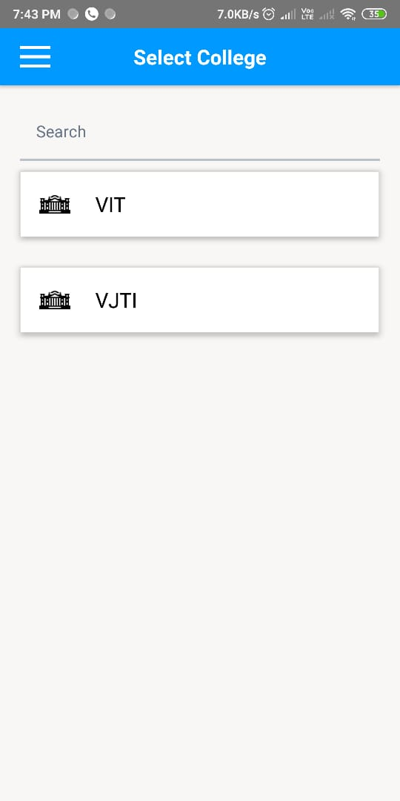

2) Select posts from the college of the user

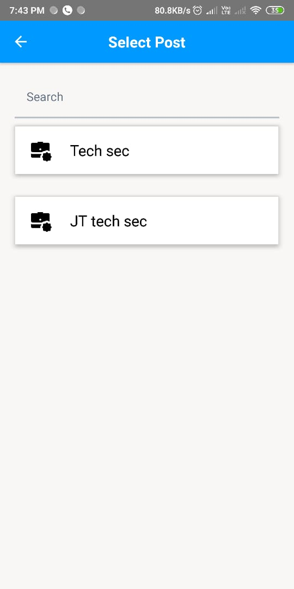 
   
3) Details will be shown. Here when you click on the phone number part you will be redirected to the phone call add you use to call without any hassle
  

 

   - Enter details screen. Here we can add the details that need to be stored. Here validation includes in the college part. There is a feature described below where the college they enter need to be present beforehand that should be added by the admin. 
  
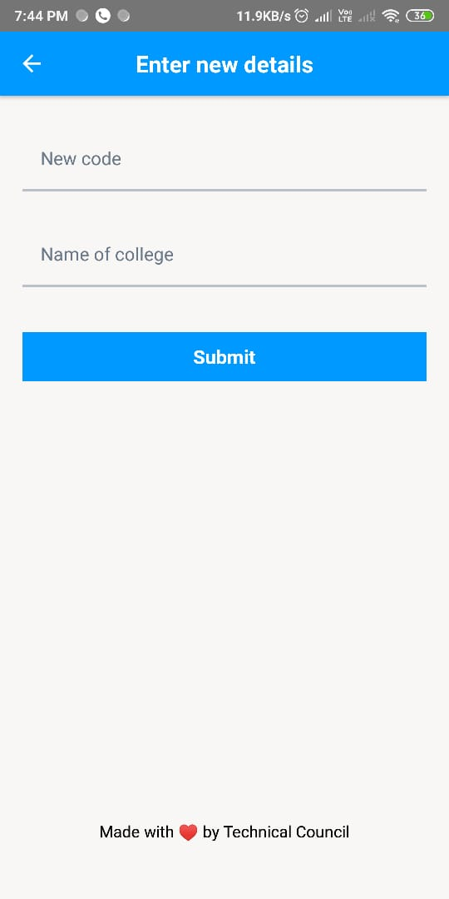

   - Add college code here this screen is visible to admins only. They can add the college code with the name

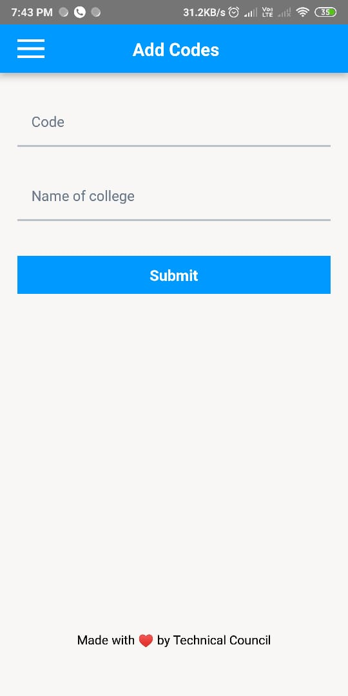

   - Browse code. Here using this users can browse the code and when they click on them they will be redirected to the enter new details screen

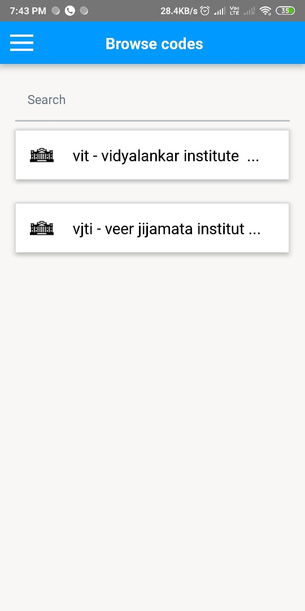

  - Edit code. Here the admn can edit the code in 2 steps 

1) Select code to edit and when the admin click them they will be directed to tyhe new screen and prompted to edt code
2) 
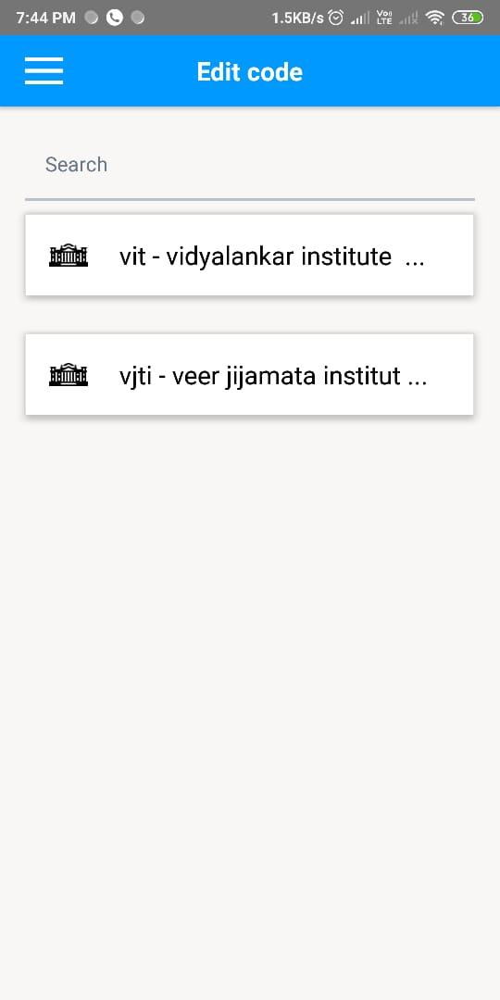

2) Here enter new details


  - Analytics. Here the admin can analyse how much data has other users have added and review them when he clicks on a user he will directed further

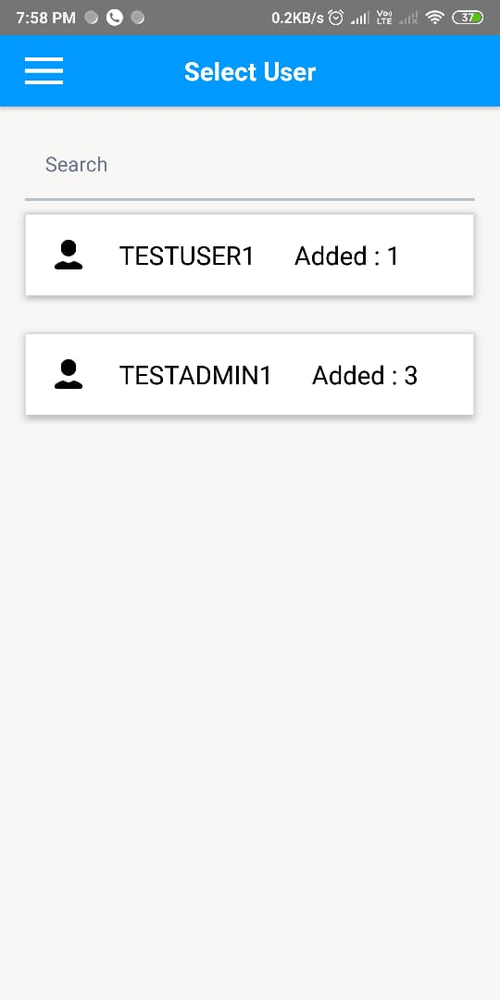

  - Here in this screen the admin can review the data entered by a user

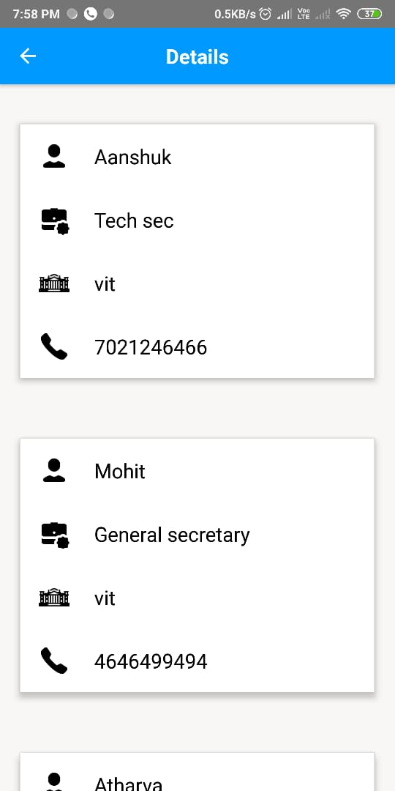

  - This is the drawer that the admin will see
  - 
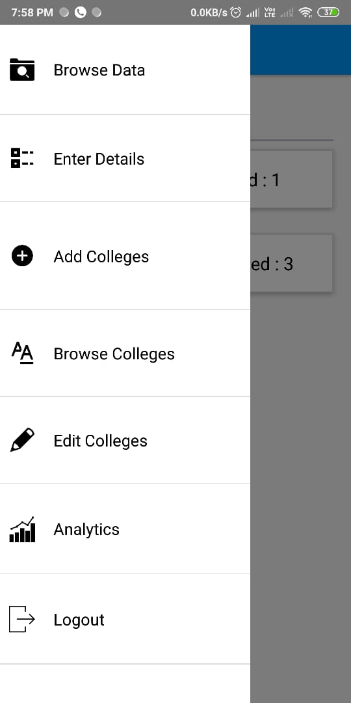


  - This is the drawer that the users will see
  
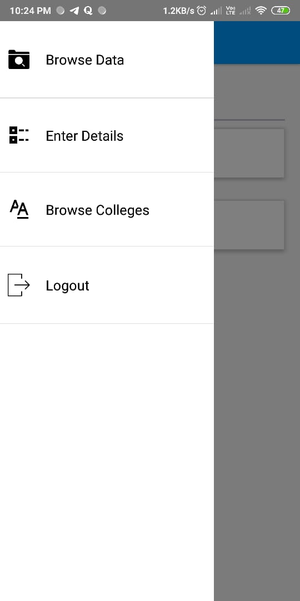


<!-- CONTRIBUTING -->
## Contributing

Contributions are what make the open source community such an amazing place to be learn, inspire, and create. Any contributions you make are **greatly appreciated**.

1. Fork the Project
2. Create your Feature Branch (`git checkout -b feature/AmazingFeature`)
3. Commit your Changes (`git commit -m 'Add some AmazingFeature'`)
4. Push to the Branch (`git push origin feature/AmazingFeature`)
5. Open a Pull Request


<!-- LICENSE -->
## License

Distributed under the MIT License. See `LICENSE` for more information.


 [](https://www.linkedin.com/in/ram2510) [](https://www.github.com/ram2510) 